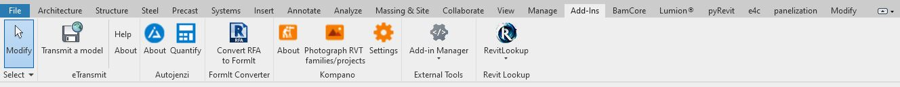
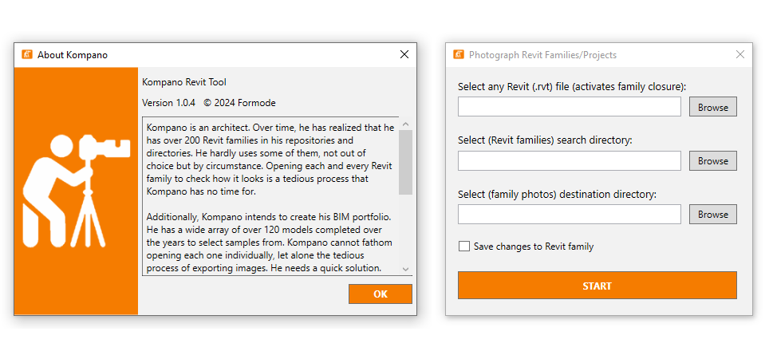
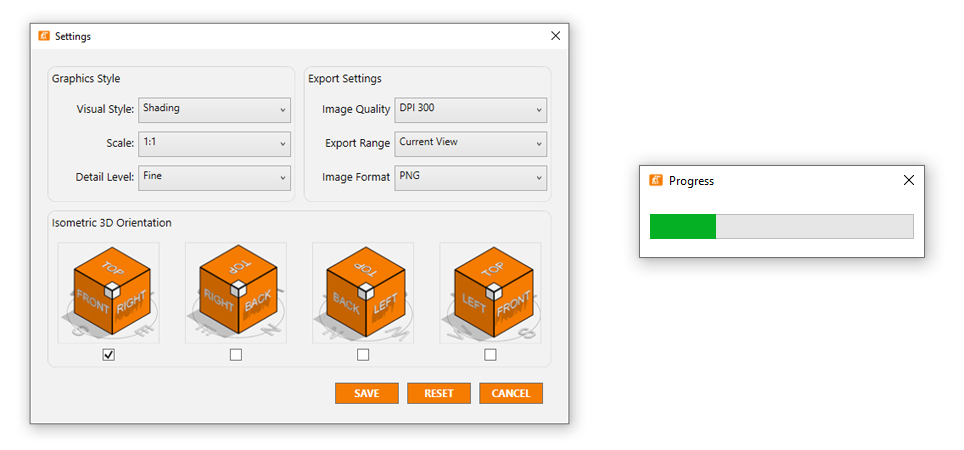


# Kompano

  

 

***Photograph your Revit Families/Projects with ease.***

 
## 📋 Summary

Kompano is an architect. Over time, he has realized that he has over 200 Revit families in his repositories and directories. He hardly uses some of them, not out of choice but by circumstance. Opening each and every Revit family to check how it looks is a tedious process that Kompano has no time for.

Additionally, Kompano intends to create his BIM portfolio. He has a wide array of over 120 models completed over the years to select samples from. Kompano cannot fathom opening each one individually, let alone the tedious process of exporting images. He needs a quick solution.

This tool, named after Kompano, simplifies the visualization process of Revit families and projects. It auto-opens up to 100 Revit families/projects, creates stunning and consistent isometric visuals, gathers the visuals into one folder, and finally auto closes the files all within a timeframe of 5 minutes!

## 📦 Some feature include:

- Auto open Revit families/projects from the search directory.
- Auto create a 3D view.
- Auto adjust the settings of the 3D view styles to suite your preference i.e.   visual style & scale.
- Auto Adjust the 3D orientation to maintain consistency.
- Auto export the images in high resolution to your preferred directory.
- Auto close revit families/projects.
- Settings command to adjust views settings to user's preference

## 📦 Future updates will include:
- Custom Graphic styles options to select from such as blue print effect, black and white Effect, white clay render
- Accommodate revit files.

 ## ⌨️ Usage Guide

Below is a illustration on how the tool works. Enjoy!
1. Navigate to the Add-ins tab and click on "Kompano".
2. Adjust your graphics and export settings to your preference using the settings Command
3. Follow the on-screen prompt and fill up all directories as instructed.
4. Click the start button to initiate the process.
5. Track the progress with a progress bar.
6. Check your desitination directory for the final photos

## ⚙️ Installation

1. Please follow last release at section [Release](https://github.com/symonkipkemei/Kompano/releases)
2. Download the installer (`KompanoInstaller.exe`).
3. Run the installer (`KompanoInstaller.exe`) and follow the installation instructions.
4. Open Revit and access the plugin from the Add-ins tab

### Version support : From Revit 2020 to Revit 2025.

## 📄 License

This sample is licensed under the terms of the [MIT License](http://opensource.org/licenses/MIT). Please see the [License](License.md) file for full details.

Credit to [icons8.com](https://icons8.com) for the Kompano icons.

© 2024 Autodesk, Inc.  All rights reserved. All use of this Software is subject to the terms and conditions of the Autodesk End User License Agreement accepted upon installation of this Software and/or packaged with the Software.

## 🍚 Contribute

**Kompano** is an open-source project. You can make suggestions or track and submit bugs via Github [issues](https://docs.github.com/en/issues/tracking-your-work-with-issues/creating-an-issue). You can submit your own code to the **Kompano** project via a Github [pull request](https://docs.github.com/en/pull-requests/collaborating-with-pull-requests/proposing-changes-to-your-work-with-pull-requests/about-pull-requests).

Feel free to contribute!
Please refer to the [CONTRIBUTING](CONTRIBUTING.md) for details.

## ✒️ Author

👤 **Symon Kipkemei**

- Github: [symonkipkemei](https://github.com/symonkipkemei)
- Twitter: [@symon_kipkemei](https://twitter.com/symon_kipkemei)
- LinkedIn: [Symon kipkemei](https://www.linkedin.com/in/symon-kipkemei/)

## 🙏 Show your support

I can't guarantee I'll fix all your problems, but I promise you'll never have to tackle them solo. 
I'm your partner in chaos! 😊

Finally, if you've read this far, don't forget to give this repo a ⭐️. 

